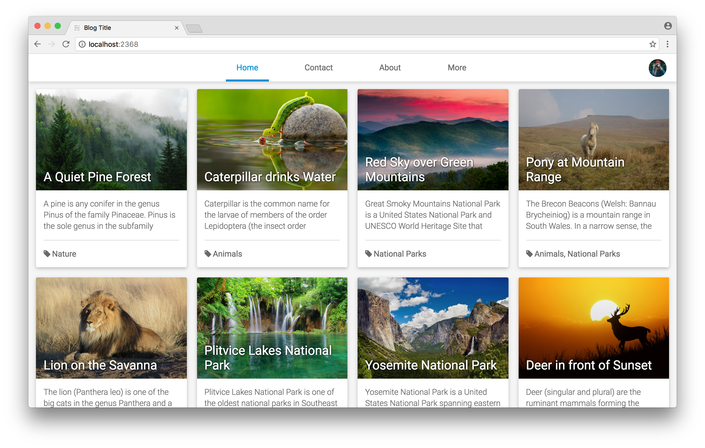

# Buster - A theme for the Ghost blogging platform

Buster is a lightweight, open source theme for the [Ghost blogging platform](https://ghost.org/). It features a simple, clean card UI and is fully responsive. It's currently in use on my personal website: [https://www.daanbeverdam.com](https://www.daanbeverdam.com).

> ⚠️ Important note: if you're running a Ghost version lower than 1.0.0, please refer to the [`legacy`](https://github.com/daanbeverdam/buster/tree/legacy) branch for a compatible version of this theme.

## Screenshots

### Desktop view

</img>

### Mobile view

</img>

## How to use

### Installation

If you want to use the theme for your own blog you can grab the latest [zip file](https://github.com/daanbeverdam/buster/archive/master.zip) from the `master` branch. Upload this file via the backend or extract it into the `content/themes/` folder of your Ghost installation. Then restart Ghost and select the theme from the backend under `Settings > General > Theme`.
Alternatively, you can clone the repository into the `content/themes/` folder by using

```
git clone https://github.com/daanbeverdam/buster.git
```

### Disqus comments

If you want to enable Disqus comments, follow the steps on the [Disqus website](https://disqus.com/admin/create/). The subdomain you create should be added to the `<head>` of the theme as a javascript variable as follows.

```
<script>
    DISQUS_SUBDOMAIN = '<subdomain>';  // replace <subdomain> with your own Disqus subdomain
</script>
```

The easiest way to do this is to just paste this in blog header via 'code injection' from the backend.

### Recommended settings

The recommended number of post per page is 11. Keep in mind that the frontpage is highly graphical and large post images may increase page load time. For optimal performance, aim for a resolution of 600 by 200 pixels.
